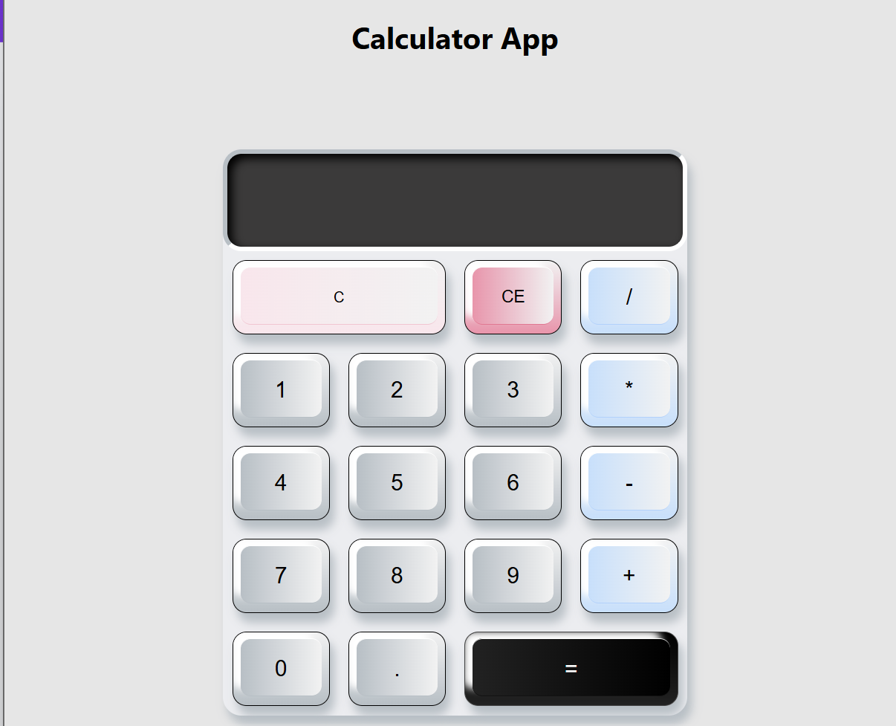

# Calculator app 

The motivation behind this project was to practice JavaScript logic, data type handling and CSS layout and design skills. 

## Table of contents

- [Overview](#overview)
  - [The challenge](#the-challenge)
  - [Screenshot](#screenshot)
  - [Links](#links)
- [My process](#my-process)
  - [Built with](#built-with)
  - [What I learned](#what-i-learned)
  - [Useful resources](#useful-resources)
  - [AI Collaboration](#ai-collaboration)
- [Author](#author)


## Overview

### Functional Requirements

Users should be able to:

- See the size of the elements adjust based on their device's screen size
- Perform mathematical operations like addition, subtraction, multiplication, and division

### Screenshot



### Links

- [Solution URL](https://github.com/NiyaBaguisa/calculator-app)
- [Live Site URL](https://niyabaguisa.github.io/calculator-app/)

## My process

### Built with

- HTML5
- CSS custom properties
- Flexbox
- CSS Grid
- Mobile-first workflow
- [React](https://reactjs.org/) - JS library

### What I learned

The main thing that I learned from this project is how the ::before pseudo-class can be used in CSS. I haven’t taken much time until now to focus on more creative ways to use CSS in my applications, but from now on I will try to be more adventurous and experimental with what CSS is capable of. Below is a snippet that shows how I was able to add extra styling to the button class under the button text using ::before

```css
/*inserts content before the buttons text*/
button::before{
  content:'';
  position:absolute;
  top: 6px;
  left: 8px;
  bottom: 10px;
  right: 8px;
  background: linear-gradient(90deg,#B5BFC6,rgba(242, 242, 242, 1));
  border-radius: 11px;
  border-bottom: 1px solid #B5BFC6;
  border-top: 1px solid white;
  box-shadow: -10px -8px 8px rgba(255, 255, 255, 1);
z-index: -1;
}

```
### Useful resources

- [Create a Keyboard using CSS & Javascript](https://www.youtube.com/watch?v=pKBXqq38Jr8) - This video was a nice inspiration on how to make the buttons look like keyboard keys.

### AI Collaboration

I used co-pilot (Claude AI) to help generate the hover and active states on the buttons I created.

## Author

- Github - [@NiyaBaguisa](https://github.com/NiyaBaguisa)
- LinkedIn - [Niya Baguisa](https://www.linkedin.com/in/niyayates/)
